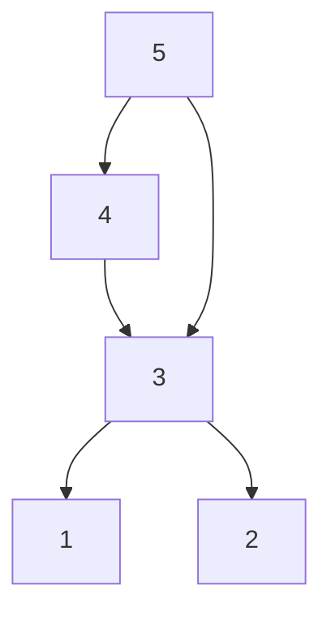
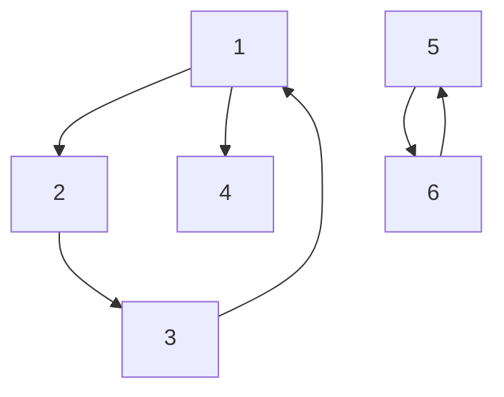
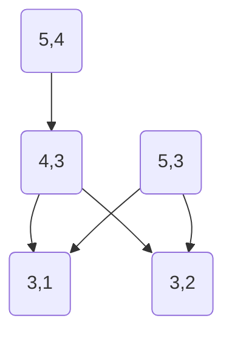
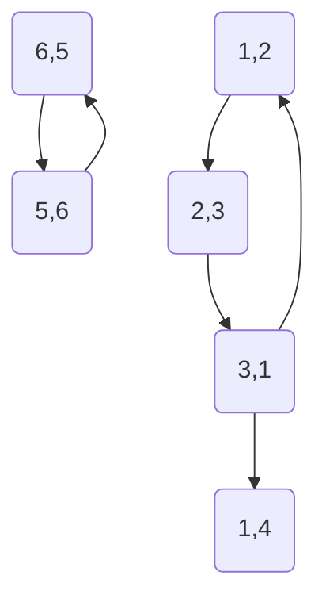

*Ich liebe es, kleine Programmieraufgaben und Kopfnüsse zu knacken. Glücklicherweise gibt es sehr viele Webseiten, auf denen man solche findet.*

*Diese Aufgabe fand ich im Archiv des Internet Problem Solving Contest, und zwar [hier](https://ipsc.ksp.sk/2008/real/problems/b.html).*

---

# Die Aufgabe

Die Problembeschreibung findet sich auf der oben verlinkten Webseite.

Diese ist ein wenig komplexer als die mit der Armee. Genauer ist dies eine graphentheoretische Aufgabe.

Für das erste Zahlenbeispiel der Aufgabenstellung lässt sich folgender Graph erzeugen, wobei eine Kante bedeutet, dass ein Server dem anderen vertraut:



Wie man sieht, ist in diesem Graph der längste Pfad 4 Knoten lang. Da es zwei Pfade gibt mit der Länge 4, die jeweils in 1 und 2 enden, ist dies die Lösung.

Das zweite Beispiel entspricht diesem Graph:



Hier sieht man bereits zwei wichtige Eigenschaften: erstens ist der Graph nicht vollständig verbunden und zweitens ist er nicht azyklisch. Auch handelt es sich bei
dem längsten Pfad nicht um einen Hamiltonschen Pfad, weil die 1 zweimal überfahren wird um zu der Lösung 4 zu gelangen.

Allerdings handelt es sich um Eulersche Pfade, es wird jede Kante nur maximal einmal besucht.

# Lösungsansatz

Pfadfragestellungen lassen sich sehr leicht über Breitensuche lösen. Die "Ebene" der Suche ist dabei der gerade betrachtete Pfad.

Also, erster Wurf:

```java
package de.grabarske.breaking_in;

import java.util.*;
import java.util.concurrent.ConcurrentHashMap;
import java.util.stream.Collectors;

public class BreakingIn implements Runnable {

    private Map<Integer, List<Vertix>> adjacencyList = new ConcurrentHashMap<>();

    public void addVertix(int from, int to) {
        Vertix v = Vertix.of(from, to);
        if (!adjacencyList.containsKey(from)) {
            adjacencyList.put(from, new ArrayList<>());
        }
        adjacencyList.get(from).add(v);
    };

    public static void main(String[] args) {
        (new BreakingIn()).run();
    }

    @Override
    public void run() {
        Scanner scanner = new Scanner(System.in);
        int number = scanner.nextInt();

        scanner.nextLine();
        scanner.nextLine();

        String line = "";

        while (scanner.hasNextLine()) {
            adjacencyList.clear();
            while (scanner.hasNextLine() && !(line = scanner.nextLine()).isEmpty()) {
                String[] numbers = line.split(" ");
                addVertix(Integer.valueOf(numbers[0]), Integer.valueOf(numbers[1]));
            }
            solve();
        }
    }

    private List<Vertix> catchVertix(Vertix v) {
        List<Vertix> newList = new ArrayList<>();
        newList.add(v);
        return newList;
    }

    private List<Vertix> appendVertix(List<Vertix> path, Vertix v) {
        List<Vertix> l = path.stream().collect(Collectors.toList());
        l.add(v);
        return l;
    }

    public void solve() {
        int currentBest = 0;
        List<Integer> resultNodes = new ArrayList<>();
        Queue<List<Vertix>> queue = new ArrayDeque<>();
        queue.addAll(adjacencyList.values()
                .stream()
                .flatMap(l -> l.stream())
                .map(this::catchVertix)
                .collect(Collectors.toList()));

        while (!queue.isEmpty()) {
            List<Vertix> currentPath = queue.poll();
            int size = currentPath.size();
            int lastTo = currentPath.get(size - 1).getTo();

            if (size > currentBest) {
                currentBest = currentPath.size();
                resultNodes.clear();
            }
            if (size >= currentBest) {
                resultNodes.add(currentPath.get(currentBest - 1).getTo());
            }

            Optional.ofNullable(adjacencyList.get(lastTo))
                    .ifPresent(vs -> vs.stream()
                        .filter(v -> !currentPath.contains(v))
                        .map(v -> appendVertix(currentPath, v))
                        .forEach(queue::add));
        }
        System.out.println(resultNodes.stream().map(String::valueOf).collect(Collectors.joining(" ")));
    }

    public static class Vertix {
        private int from;
        private int to;

        private Vertix(int from, int to) {
            this.from = from;
            this.to = to;
        }

        public static Vertix of(int from, int to)  {
            return new Vertix(from, to);
        }

        public int getFrom() {
            return from;
        }

        public int getTo() {
            return to;
        }

        public boolean equals(Object o) {
            if (o instanceof Vertix) {
                Vertix v2 = (Vertix) o;
                return (from == v2.getFrom()) && (to == v2.getTo());
            }
            return false;
        }
    }
}
```

Dummerweise zeigt sich, dass diese Lösung tatsächlich naiv ist. Schon beim ersten Datensatz bricht die Ausführung nach über 5 Minuten ab, weil der Heapspace aufgebraucht wurde.

Gibt es eine geschicktere Art und Weise das Problem zu lösen? 

# Zweiter Versuch: der Kantenbaum

In einem azyklischen gerichteten Graphen lässt sich die Suche nach dem längsten Pfad in linearer Zeit lösen.

Das ist schön, aber unsere Graphen hier sind gar nicht azyklisch. Insbesondere muss mit einberechnet werden, dass beim zweiten Beispiel ein Knoten zweimal besucht wurde. Was
aber auf gar keinen Fall mehrfach besucht wird bei den Wegen sind die Kanten.

Vielleicht ist daher der folgende Ansatz zielführender: statt dem Ursprungsgraphen betrachten wir den Kantengraphen, also ein Graph, bei
dem jede Kante des Ursprungsgraphen als Knoten repräsentiert ist und jeder Knoten als Kante.

Für Beispiel 1 entsteht dann:



Und für Beispiel 2:


