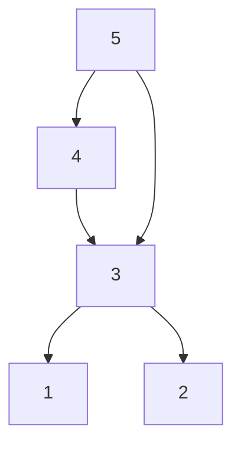
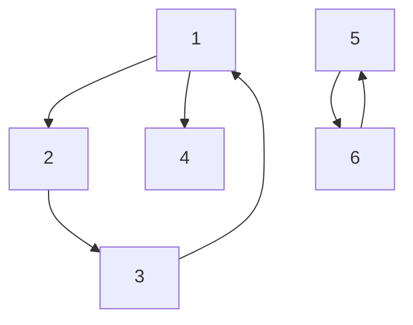

*Ich liebe es, kleine Programmieraufgaben und Kopfnüsse zu knacken. Glücklicherweise gibt es sehr viele Webseiten, auf denen man solche findet.*

*Diese Aufgabe fand ich im Archiv des Internet Problem Solving Contest, und zwar [hier](https://ipsc.ksp.sk/2008/real/problems/b.html).*

---

# Die Aufgabe

Die Problembeschreibung findet sich auf der oben verlinkten Webseite.

Diese ist ein wenig komplexer als die mit der Armee. Genauer ist dies eine graphentheoretische Aufgabe.

Für das erste Zahlenbeispiel der Aufgabenstellung lässt sich folgender Graph erzeugen, wobei eine Kante bedeutet, dass ein Server dem anderen vertraut:

Das zweite Beispiel entspricht diesem Graph:

Im zweiten Fall ist die Lösung 4, da 
