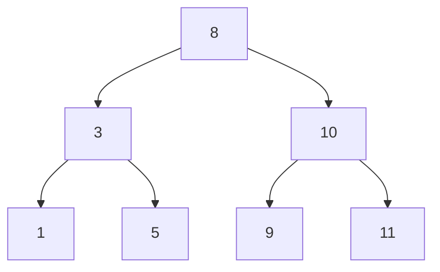

Here are three things that I learned at uni that blew my mind:

1. All searches are tree traversals
2. All search strategies can be implemented by choosing the right queue
3. Every (AI) problem can be expressed as a search

Let's look at all three of these statements in turn.

# All searches are tree traversals

Let's look at a couple of examples for searches:

1. Check whether an XML document contains a *node*-tag.
2. Determine whether an array of *n* integers contains the integer *x*.
3. Starting from Picadilly Circus in London, find the best route to Trafalgar Square.
4. Given a set of things we know about the world, try to prove a statement *X*.

For the XML document example, the search is obviously a tree traversal. After all,
an XML document is a tree and, if push comes to shove, we need to check every single
node in that tree. So we need to traverse the tree.

The second example is not that intuitive, but remember that we have are interested
in what we are looking at during a search. If the array is unordered, like this:

5 8 1 10 11 3 9

then we have to look at each element in turn. But that is the same as traversing
a list. And a list is a special case of a tree. So in that example, too, we are
talking about a tree traversal.

This gets a bit more obvious when the array is sorted and we can use a smarter algorithm.

If the array looks like this

1 3 5 8 9 10 11

and I'm wondering whether the number 10 is in the array, we can use the following algorithm for finding
a value $$x$$ in a sorted array $$arr$$ with $$n$$ elements:

1. Set $$a := 0$$ and $$b := n - 1$$
2. If $$x < arr[a]$$ or $$x > arr[b]$$ then $$x$$ is not in $$arr$$. End.
3. Set $$c := \lceil \frac{b-a}{2} \rceil$$
4. If $$x == arr[c]$$ then $$x$$ is in $$arr$$ at position $$c$$. End.
5. If $$x < arr[c]$$ then set $$b := c - 1$$ and go to step 2.
6. If $$x > arr[c]$$ then set $$a := c + 1$$ and go to step 2.

This may not look like a tree at first, until we write down the possible order of nodes that are examined:



If $x$ is bigger than 8, we go down the right branch, otherwise the left branch, and so forth.

This gives us a time complexity of $$O(log(n))$$ - the height of a tree.

Alright, but what about our satnav example? I mean, we are talking about a complicated graph there.

Yes, but remember that when searching in graphs, we usually avoid circles. So we are looking for paths,
starting from a start node that do not have cycles - in other words, we are looking for a tree. And we
are looking for that tree by walking through the graph.

So, even if we don't have an explicite data structure called a tree, every search is a tree traversal -
of a so-called search tree.

# All search strategies can be implemented by choosing the right queue

As you may recall, the three main types for search strategies are:

1. Depth-first search
2. Breadth-first search
3. Best-first search

The first tries to dig deep and favours going down new paths before looking at other nodes.
The second one tries to look at all nodes of the same distance from the root node before going deeper.
And the third one looks at the most promising node first, whatever that one is.

My mind was blown when I learned that all of these searches can be implemented by the same
search algorithm if it uses a queue to keep track of all nodes that have yet to be examined
and if you choose the correct type of queue for the strategy you want.

Back then I was big into Lisp programming and this is what it looked like there:

```lisp
(defun search (start expand-fn goal-fn enqueue-fn dequeue-fn)
  (funcall enqueue-fn start)
  (loop for elm in (funcall dequeue-fn)
        while (and elm (not (funcall goal-fn elm)))
		do
		(progn 
		  (mapcar enqueue-fn (funcall expand-fn elm)))))
```

You get the different search strategies by plugging in the correct queue:

Search strategy | Type of Queue
----------------|----------------
Depth-first     | Stack
Breadth-first   | Queue
Best-first      | Priority Queue

That means: you can implement a search algorithm and decide the correct strategy later, closing
the algorithm early for modification, while its behaviour can still be modified.

Nice.

Of course, what's even nicer: tree traversal in general follows one of the three strategies.
So this works even if we "just" want to walk the whole tree, graph or whatever structure we are
looking at. We just need to select the correct queue.

# Every (AI) problem can be expressed as a search

This one takes a lot more explaining than the other two. For now, look at the fourth example.
Imagine that everything a machine "knows" is set as formulas in its brain and now it needs
to find the right knowledge to apply in a situation. We already phrased it the right way, it is
a form of search.

The real proof takes some more time and effort - if you are interested, do tell me and I will
try to put it in understandable terms
